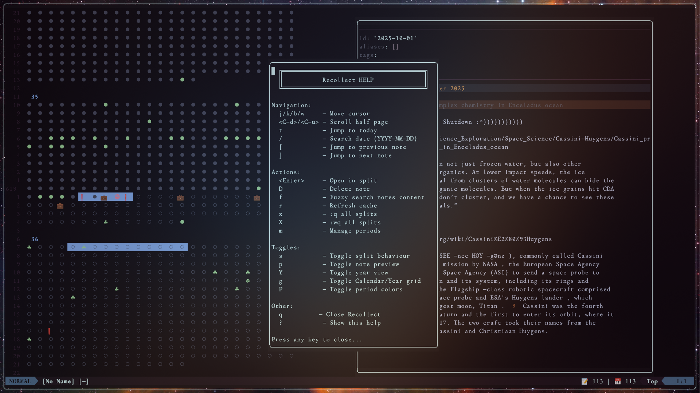

# recollect 

Nvim Plugin to visualize, compare and edit Notes in a Grid.

-> Checks a folder for all files: "YYYY-MM-DD.md"  
-> Places them on a Grid.  
-> Grid has 2 Modes:   
    1. renders for a Year since the 1st of Jan. 
    2. you can set a Custom date (Project start or your Birthday or whatever) 
-> Plugin can read your YAML frontmatter; allows dynamically changing
   symbols based on tags in your .md files. 
-> Grid shows Current date, Years , Months, Days counter since the
   Grid strarting Date, aswell as the Weekday of the Dot your cursor
   is on. 
-> you can highlight and edit time periods. 
-> you can toggle split behaviour to replace the current note, or open
   two notes and alwys replace the older one. Splits are done
   automatically based on width/height racio of your window. 

This is a personal project and many aspects are vibe coded after hours
of researching and already drinking too much coffe for my master
thesis. Since I switched from Obsidian to Nvim for all notetaking and
writing, I was missing a option to visually see my dailies and so this
was born. If anyone is interestet to vet or refactor, i would
appreciate that! 

## Preview




## Usage
Open Recollect: 

```
:Recollect
```

you can always press '?' for help. 

## Default Keybindings


| Key | Description |
|:---|:---|
| **Navigation** | |
| `j/k/b/w` | Move cursor |
| `<C-d>/<C-u>` | Scroll half page |
| `t` | Jump to today |
| `/` | Search date (YYYY-MM-DD) |
| `[` | Jump to previous note |
| `]` | Jump to next note |
| **Actions** | |
| `<Enter>` | Open in split |
| `D` | Delete note |
| `f` | Fuzzy search notes content |
| `r` | Refresh cache |
| `x` | Close all splits (`:q all`) |
| `X` | Write and quit all splits (`:wq all`) |
| `m` | Manage periods |
| **Toggles** | |
| `s` | Toggle split behaviour |
| `p` | Toggle note preview |
| `Y` | Toggle year view |
| `g` | Toggle Calendar/Year grid |
| `P` | Toggle period colors |
| **Other** | |
| `q` | Close Recollect |
| `?` | Show this help |


## Installation / Config
### Install with Lazy: 

```lua
-- ~/.config/nvim/lua/plugins/recollect.lua
return {
  "jbuck95/recollect.nvim",
  dependencies = { "nvim-lua/plenary.nvim" },
  config = function()
    require("recollect").setup({
      -- All configuration options are optional.
      -- Below are some examples you can override.
      
      -- The start date for your grid.
      birthday = "1990-01-01",
      
      -- The path to your daily notes folder.
      -- IMPORTANT: Make sure to change this to your actual notes path.
      daily_notes_path = vim.fn.expand("~") .. "/Documents/Notes/Dailies",
      
      -- A function to generate the content for a new daily note.
      note_template = function(date_str)
        local year, month, day = date_str:match("(%d+)-(%d+)-(%d+)")
        local date_obj = os.time({year=tonumber(year), month=tonumber(month), day=tonumber(day)})
        
        local weekdays = {"Sunday", "Monday", "Tuesday", "Wednesday", "Thursday", "Friday", "Saturday"}
        local months = {"January", "February", "March", "April", "May", "June", "July", "August", "September", "October", "November", "December"}
        
        local wday = tonumber(os.date("%w", date_obj)) + 1
        local formatted_date = string.format("%s, %d %s %s", weekdays[wday], tonumber(day), months[tonumber(month)], year)
        
        return string.format([[---
date: %s
---
### %s


]], date_str, formatted_date)
      end,

      -- You can define custom time periods that get highlighted in the grid.
      periods = {
        {
          start = "2020-03-11",
          finish = "2022-05-01",
          color = "red",
          label = "Pandemic"
        },
      },

      -- Symbols used for notes that have a specific tag in their YAML frontmatter.
      tag_symbols = {
        birthday = "🎂",
        event = "🎉",
        gym = "💪🏼",
        trip = "✈️",
        holiday = "☘",
        party = "🍻",
        work = "💼",
        project = "🛠️",
        deadline = "❗",
        health = "❤️",
        special = "⭐",
      },

      -- Customize the colors of the grid.
      colors = {
        background = "#1e1e2e",
        default_dot = "#45475a",
        today_dot = "#f38ba8",
        note_exists = "#a6e3a1",
        grid_lines = "#313244",
        text = "#cdd6f4",
        year_header = "#89b4fa",
        yellow = "#f9e2af",
        blue = "#89b4fa",
        green = "#a6e3a1",
        red = "#f38ba8",
        purple = "#cba6f7",
        orange = "#fab387",
      },
    })
  end,
}
```

### Config
you can configure further in the config.lua. For e.g. the Tag-Symbols or
periods (if you define periods in recall, they get saved in your nvim
folder as recollect.json)
```

  periods = {
    
  },
  tag_symbols = {
    birthday = "🎂",
    event = "🎉",
    gym = "💪🏼",
    trip = "✈️",
    feiertag = "☘",
    party = "🍻",
    work = "💼",
    tinker = "🛠️",
    deadline = "❗",
    deal = "🤝",
    personal = "👤",
    health = "❤️",
    special = "⭐",
    nasa = "🌠",
  },
  colors = {
    background = "#1e1e2e",
    default_dot = "#45475a",
    today_dot = "#f38ba8",
    note_exists = "#a6e3a1",
    grid_lines = "#313244",
    text = "#cdd6f4",
    year_header = "#89b4fa",
    yellow = "#f9e2af",
    blue = "#89b4fa",
    green = "#a6e3a1",
    red = "#f38ba8",
    purple = "#cba6f7",
    orange = "#fab387",
  },
}
```


## Credits

- This plugin is heavily inspired by the [obsidian-life-grid](https://github.com/mrdonado/obsidian-life-grid) plugin!

## License

MIT
